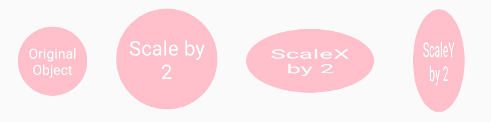

# React Native Transforms
---

Transform, 2D ve 3D dönüşümler ile component'lerin yerini ve şeklini değiştirmemizi sağlar. Component'e verilen style özelliklerini transform property'sine göre manipüle eder. **Dikkat edilmesi gereken nokta** ise transform edilen component diğer component'ler ile çakışabilir, uygulamada kötü bir görünüme yol açar. Bunun için **StyleSheet** ile component'lerin aralarına gerektiği kadar **margin** ve **padding** bırakmayı unutmayın!

## Methods

Tek bir methodu vardır: `transform()`Yapılacak değişiklikleri ise `transform()` metoduna verilen propertyler belirler. 

### transform()

 `transform()`,  bir array içerisinde property'leri kabul eder. Properties, **px**, **rad**, **deg** ve **%** değerlerini kabul eder.
 

    transform([{  rotateX:  '45deg'  },  {  rotateZ:  '0.785398rad'  }])

 

## Properties

 - ### scale

scale, **number** değer alır. Uygulanan component'in boyutunu verilen number değer kadar değiştirir. **scale**, **scaleX** ve **scaleY** kullanımları vardır. 

        <View style={styles.box}>
            <Text style={styles.text}>Original Object</Text>
        </View>
            /////X ve Y ekseninde boyut değişimi/////
        <View style={[styles.box,{transform: [{scale: 2}],},]}>
            <Text style={styles.text}>Scale by 2</Text>
        </View>
            /////X ekseninde boyut değişimi/////
        <View style={[styles.box,{transform: [{scaleX: 2}],},]}>
            <Text style={styles.text}>ScaleX by 2</Text>
        </View>
            /////Y ekseninde boyut değişimi/////
        <View style={[styles.box,{transform: [{scaleY: 2}],},]}>
            <Text style={styles.text}>ScaleY by 2</Text>
        </View>
 
 

 - ### rotate
 rotate, belirtilen değer kadar component'in döndürülmesini sağlar. **rotate**, **rotateX**, **rotateY** ve **rotateZ** kullanımları vardır. 

            /////45 derece döndürme/////
        <View style={[styles.box,{transform: [{rotate: '45deg'}],},]}>
            <Text style={styles.text}>Rotate by 45 deg</Text>
        </View>
            /////X ve Z eksenlerinde 45 derece döndürme/////
        <View style={[styles.box,{transform: [{rotateX: '45deg'}, {rotateZ:'45deg'}],},]}>
            <Text style={styles.text}>Rotate X&Z by 45 deg</Text>
        </View>
            /////Y ve Z eksenlerinde 45 derece döndürme/////
        <View style={[styles.box,{transform: [{rotateY: '45deg'}, {rotateZ:'45deg'}],},]}>
            <Text style={styles.text}>Rotate Y&Z by 45 deg</Text>
        </View>

   

 - ### skew
 skew, belirtilen değer kadar component'i çarpıtır. **skew**, **skewX**, **skewY** ve **skewZ** kullanımları vardır. 

            /////45 derece çarpıtma/////
        <View style={[styles.box,{transform: [{skewX: '45deg'}],},]}>
            <Text style={styles.text}>SkewX by 45 deg</Text>
        </View>
            /////Y ekseninde 45 derece çarpıtma/////
        <View style={[styles.box,{transform: [{skewY: '45deg'}],},]}>
            <Text style={styles.text}>SkewY by 45 deg</Text>
        </View>
            /////X ve Z ekseninde 30 derece çarpıtma/////
        <View style={[styles.box,{transform: [{skewX: '30deg'}, {skewY: '30deg'}],},]}>
            <Text style={styles.text}>Skew X&Y by 30 deg</Text>
        </View>

   

 - ### translate
 translate, belirtilen değer kadar component'in yerini değiştirir. **translateX** ve **translateY** kullanımları vardır. X ekseninde negatif(-) değerler sola, pozitif(+) değerler sağa doğru kayar. Y ekseninde negatif(-) değerler yukarı, pozitif(+) değerler aşağıya doğru kayar.

            /////X ekseninde 50 birim sağa/////
        <View style={[styles.box,{transform: [{translateX: 50}],},]}>
            <Text style={styles.text}>TranslateX by 50 </Text>
        </View>
            /////Y ekseninde 140 birim yukarı/////
        <View style={[styles.box,{transform: [{translateY: -140}],},]}>
            <Text style={styles.text}>TranslateY by -140 </Text>
        </View>

   
